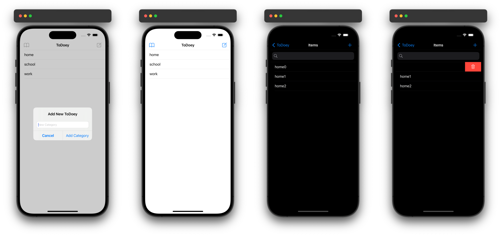

# ToDoey

## Introduction
ToDoey is a simple yet powerful iOS application designed to help you manage your daily tasks efficiently. With a user-friendly interface and seamless integration with Core Data, ToDoey ensures your to-do lists are always accessible and easy to manage. Whether you're organizing tasks by categories or searching for specific items, ToDoey provides all the essential features you need to stay productive.

### Preview

  

## Features
- **Category Management**: Organize your tasks into categories for better management.
- **Add, Edit, and Delete Tasks**: Easily add new tasks, mark them as completed, or delete them.
- **Search Functionality**: Quickly find tasks using the built-in search bar.
- **Persistent Storage**: Save your tasks and categories securely using Core Data.
- **Swipe to Delete**: Swipe tasks or categories to delete them with ease.
- **View All Tasks**: View all tasks across categories with a single tap.

## Code Structure

### `ToDoListViewController`
This view controller manages the main to-do list interface.
- **Properties**:
  - `itemArray`: An array to hold the tasks.
  - `selectedCategory`: The category currently selected by the user.
  - `context`: The Core Data context for saving and loading data.
- **Methods**:
  - `viewDidLoad()`: Sets up the view and loads tasks.
  - `tableView(_:numberOfRowsInSection:)`: Returns the number of tasks.
  - `tableView(_:cellForRowAt:)`: Configures the task cell.
  - `tableView(_:didSelectRowAt:)`: Toggles task completion status.
  - `tableView(_:trailingSwipeActionsConfigurationForRowAt:)`: Handles task deletion.
  - `addButtonPressed(_:)`: Presents an alert to add a new task.
  - `saveItems()`: Saves tasks to Core Data.
  - `loadItems(with:predicate:)`: Loads tasks from Core Data.
  - **UISearchBarDelegate** Methods:
    - `searchBarSearchButtonClicked(_:)`: Handles search button click.
    - `searchBar(_:textDidChange:)`: Handles text change in the search bar.

### `CategoryViewController`
This view controller manages task categories.
- **Properties**:
  - `categories`: An array to hold the categories.
  - `context`: The Core Data context for saving and loading data.
- **Methods**:
  - `viewDidLoad()`: Sets up the view and loads categories.
  - `tableView(_:numberOfRowsInSection:)`: Returns the number of categories.
  - `tableView(_:cellForRowAt:)`: Configures the category cell.
  - `tableView(_:didSelectRowAt:)`: Segues to the tasks of the selected category.
  - `tableView(_:trailingSwipeActionsConfigurationForRowAt:)`: Handles category deletion.
  - `addButtonPressed(_:)`: Presents an alert to add a new category.
  - `viewAllPressed(_:)`: Segues to view all tasks across categories.
  - `saveCategories()`: Saves categories to Core Data.
  - `loadCategories(with:)`: Loads categories from Core Data.

## Conclusion
ToDoey is designed to be a simple yet effective tool for managing your tasks. With features that cater to organizing, adding, and searching for tasks, ToDoey ensures that you stay on top of your to-do list. The use of Core Data for persistent storage guarantees that your tasks are safe and always available. We hope ToDoey helps you stay productive and organized.
